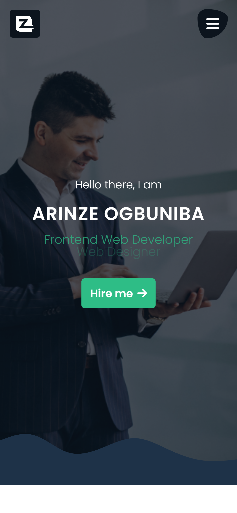
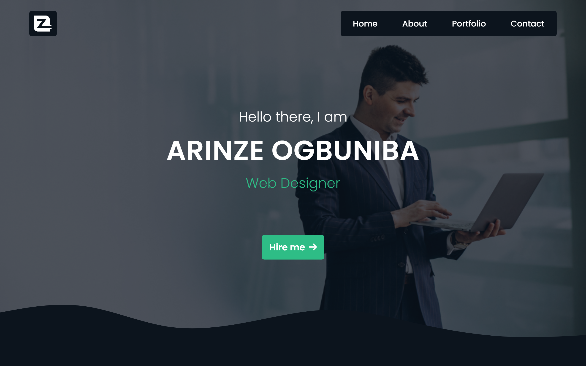

# FreeCodeCamp - Personal Portfolio project

This project is focused on building an app that is functionally similar to [FreeCodeCamp landing page](https://personal-portfolio.freecodecamp.rocks/).

## Table of contents

- [Overview](#overview)
  - [User Stories](#user-stories)
  - [Screenshot](#screenshot)
  - [Links](#links)
- [My process](#my-process)
  - [Built with](#built-with)
  - [Useful resources](#useful-resources)
- [Author](#author)

## Overview

### User Stories

The following guidelines were provided:

- Your portfolio should have a welcome section with an id of welcome-section

- Your portfolio should have a projects section with an id of projects

- Your portfolio should have a navbar with an id of navbar

- The projects section should contain at least one link to a project

- The navbar should contain at least one link that you can click on to navigate to different sections of the page

- Your portfolio should have a link with an id of profile-link, which opens your GitHub or freeCodeCamp profile in a new tab

- Your portfolio should have at least one media query

- The navbar should always be at the top of the viewport

- The navbar should always be at the top of the viewport

### Screenshot

### Links

- Live Site URL: [Preview website](https://kushyzee.github.io/personal-portfolio/#)

## My process

### Built with

- Semantic HTML5 markup
- CSS custom properties
- Mobile-first workflow
- CSS flexbox

### Useful resources

## Author

- Twitter - [@kushyzeena](https://www.twitter.com/kushyzeena)
